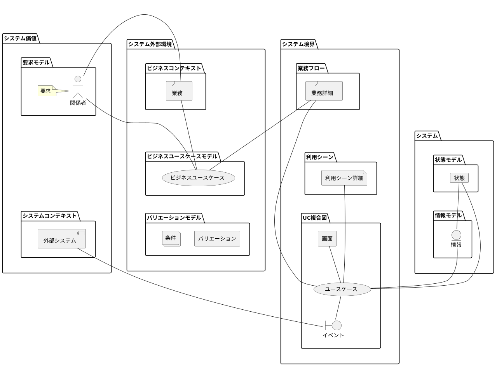

# RDRA2.0 on HonKit

## RDRAダイアグラムの関係

```plantuml

@startuml


package システム価値 {
    package 要求モデル {
        actor 関係者
        note left: 要求
    }
    package システムコンテキスト {
        component 外部システム
    }
}
package システム外部環境 {
    package ビジネスコンテキスト {
        frame 業務
    }
    package ビジネスユースケースモデル {
        usecase ビジネスユースケース
    }
    package バリエーションモデル {
        agent バリエーション
        collections 条件
    }
}
package システム境界 {
    package 業務フロー {
        frame 業務詳細
    }
    package 利用シーン {
        file 利用シーン詳細
    }
    package UC複合図 {
        rectangle 画面
        usecase ユースケース
        boundary イベント
    }
}
package システム {
    package 状態モデル {
        card 状態
    }
    package 情報モデル {
        entity 情報
    }
}
' 関連
関係者 - 業務
関係者 - ビジネスユースケース
業務 -- ビジネスユースケース
ビジネスユースケース - 利用シーン
業務詳細 - ビジネスユースケース

業務詳細 -- ユースケース
利用シーン詳細 - ユースケース
画面 -- ユースケース
ユースケース -- イベント

外部システム - イベント

状態 --- ユースケース
ユースケース - 情報
状態 -- 情報


' 配置整理
システム価値 -[hidden] システム外部環境
    要求モデル -[hidden]-- システムコンテキスト

システム外部環境 -[hidden] システム境界
    ビジネスコンテキスト -[hidden]- ビジネスユースケースモデル
    ビジネスユースケースモデル -[hidden]- バリエーションモデル

システム境界 -[hidden] システム

    業務フロー -[hidden]- 利用シーン
    利用シーン -[hidden]- UC複合図

    状態モデル -[hidden]- 情報モデル

@enduml
```

---

権利関係に問題がありましたら、ご連絡いただけますと幸いです。
