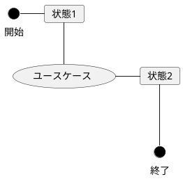

# システム

--

## 情報モデル

```plantuml
@startuml
' オブジェクト図を利用しています。

' 要素
object 情報1
object 情報2

' 関連
情報1 -- 情報2


@enduml
```

--

## 状態モデル

```plantuml
@startuml
' ユースケースを含めるため、配置図を利用しています。

' 要素
usecase ユースケース
card 状態1
card 状態2
circle 開始 #black
circle 終了 #black

' 関連
開始 - 状態1
状態1 -- ユースケース
ユースケース - 状態2
状態2 -- 終了

@enduml
```

--
