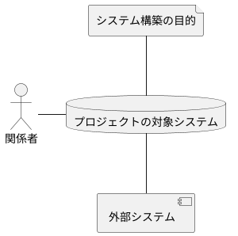

# システム価値

---

## 要求モデル

```plantuml
@startuml
' 配置図を利用します。
' アクターは `actor` で、要求は `file` で描画します。

' 要素
actor 関係者
file 要求

' 関連
関係者 - 要求

@enduml
```

---

## システムコンテキスト

```plantuml
@startuml
' 配置図を利用します。
' アクターは `actor` で、外侮システムは `component` で描画します。

' 要素
actor 関係者
component 外部システム
database プロジェクトの対象システム
file システム構築の目的

' 関連
関係者 - プロジェクトの対象システム
プロジェクトの対象システム -- 外部システム
システム構築の目的 -- プロジェクトの対象システム


@enduml
```
