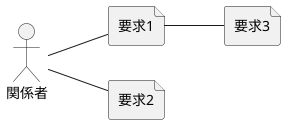
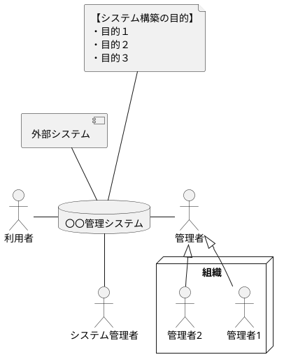

# システム価値

---

## 要求モデル

このダイアグラムでは、要求から重要なものを選び出し要求の関係を整理することで、システム化の方向性を明らかにします。

```plantuml
@startuml
left to right direction
' 配置図を利用します。
' アクターは `actor` で、要求は `file` で描画します。

' 要素
actor 関係者
file 要求1
file 要求2
file 要求3

' 関連
関係者 -- 要求1
関係者 -- 要求2

要求1 -- 要求3

@enduml
```

---

## システムコンテキスト

要件定義の最初の時点で関わるアクターと外部システムについてのプロジェクトメンバーの認識を合わせるために作成します。

```plantuml
@startuml
' 配置図を利用します。
' アクターは `actor` で、外侮システムは `component` で描画します。

' 要素
actor 利用者
actor 管理者
node 組織 {
  actor 管理者1
  actor 管理者2
}

actor システム管理者
component 外部システム
database プロジェクトの対象システム as "
〇〇管理システム
"
file システム構築の目的 as "
【システム構築の目的】
・目的１
・目的２
・目的３
"

' 関連
システム構築の目的 --- プロジェクトの対象システム
利用者 - プロジェクトの対象システム
プロジェクトの対象システム - 管理者
管理者 <|-- 管理者1
管理者 <|-- 管理者2
プロジェクトの対象システム -- システム管理者
外部システム -- プロジェクトの対象システム


@enduml
```
