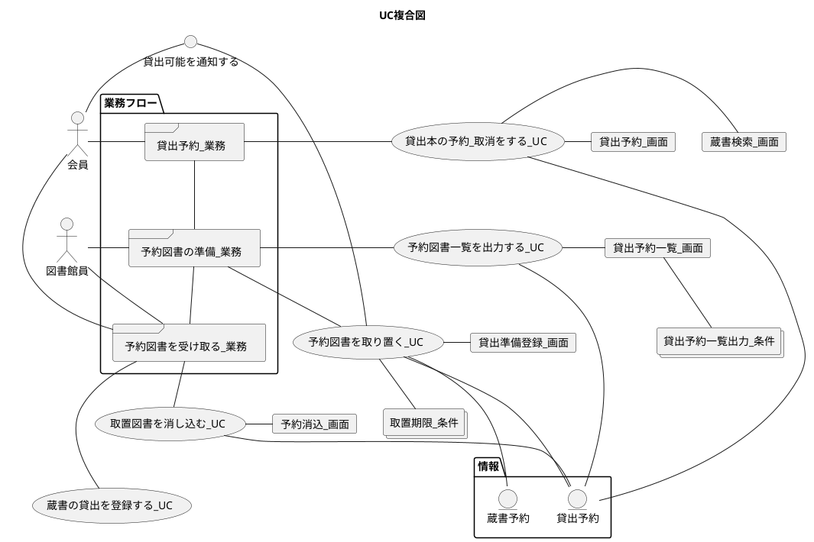

# UC 複合図サンプル

---

## サンプル

```plantuml
@startuml

top to bottom direction

title UC複合図

' アクティビティ
package 業務フロー {
    frame 貸出予約_業務
    frame 予約図書の準備_業務
    frame 予約図書を受け取る_業務
}
' 画面
card 蔵書検索_画面
card 貸出予約_画面
card 貸出予約一覧_画面
card 貸出準備登録_画面
card 予約消込_画面
' ユースケース
    usecase 貸出本の予約_取消をする_UC
    usecase 予約図書一覧を出力する_UC
    usecase 予約図書を取り置く_UC
    usecase 取置図書を消し込む_UC
    usecase 蔵書の貸出を登録する_UC
' 情報
package 情報 {
    entity 貸出予約
    entity 蔵書予約
}

' イベント
interface 貸出可能を通知する
' アクター
actor 会員
actor 図書館員
' 条件
collections 貸出予約一覧出力_条件
collections 取置期限_条件

' 関連

' 業務順序
貸出予約_業務 -- 予約図書の準備_業務
予約図書の準備_業務 -- 予約図書を受け取る_業務

' アクター to 業務アクティビティ
会員 - 貸出予約_業務
図書館員 - 予約図書の準備_業務
会員 - 予約図書を受け取る_業務
図書館員 - 予約図書を受け取る_業務

' ユースケース順序
貸出本の予約_取消をする_UC -[hidden]- 予約図書一覧を出力する_UC
予約図書一覧を出力する_UC -[hidden]- 予約図書を取り置く_UC
予約図書を取り置く_UC -[hidden]- 取置図書を消し込む_UC
取置図書を消し込む_UC -[hidden]- 蔵書の貸出を登録する_UC

' 業務 to ユースケース
貸出予約_業務 - 貸出本の予約_取消をする_UC
予約図書の準備_業務 - 予約図書一覧を出力する_UC
予約図書の準備_業務 - 予約図書を取り置く_UC
予約図書を受け取る_業務 - 取置図書を消し込む_UC
予約図書を受け取る_業務 - 蔵書の貸出を登録する_UC

' ユースケース to 画面
貸出本の予約_取消をする_UC - 蔵書検索_画面
貸出本の予約_取消をする_UC - 貸出予約_画面
予約図書一覧を出力する_UC - 貸出予約一覧_画面
予約図書を取り置く_UC - 貸出準備登録_画面
取置図書を消し込む_UC - 予約消込_画面

' ユースケース to エンティティ
貸出本の予約_取消をする_UC -- 貸出予約
予約図書一覧を出力する_UC -- 貸出予約
予約図書を取り置く_UC -- 貸出予約
予約図書を取り置く_UC -- 蔵書予約
取置図書を消し込む_UC -- 貸出予約

' ユースケース to イベント
貸出可能を通知する -- 予約図書を取り置く_UC

' イベント to アクター
貸出可能を通知する -- 会員

' 条件
貸出予約一覧_画面 -- 貸出予約一覧出力_条件
予約図書を取り置く_UC -- 取置期限_条件

@enduml

```
