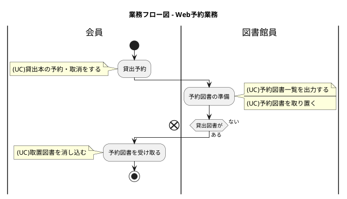

# 業務フローサンプル

---

```plantuml
@startuml
title 業務フロー図 - Web予約業務

|会員|
start
:貸出予約;
note left
(UC)貸出本の予約・取消をする
end note

|図書館員|
:予約図書の準備;
note right
(UC)予約図書一覧を出力する
----
(UC)予約図書を取り置く
end note

if (貸出図書が) then (ない)

|会員|
end
else (ある)

:予約図書を受け取る;
note left: (UC)取置図書を消し込む
stop

endif
@enduml
```
