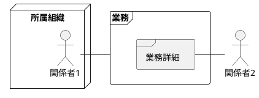
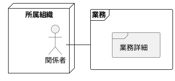
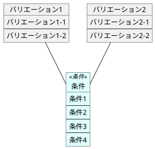

# システム外部環境

---

## ビジネスコンテキスト

このダイアグラムではシステム化対象の最上位のビジネス単位を明らかにします。

---

### ビジネスユースケース

ビジネスユースケースは、ビジネスコンテキスト上の各業務を、それぞれさらにブレイクダウンした形で記述します。

---

### バリエーション

ビジネスの現場で使われているルールがビジネスルールです。
ビジネスルールの元になる「バリエーション」と、その組み合わでである「条件」を記述します。

