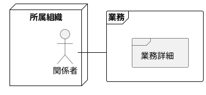

# システム外部環境

---

## ビジネスコンテキスト

```plantuml
@startuml
' 配置図を利用します。

' 要素
node 所属組織 {
    actor 関係者
}
frame 業務 {
    frame 業務詳細
}

' 関連
関係者 - 業務

@enduml
```

---

### ビジネスユースケース

ビジネスユースケースは、ビジネスコンテキスト上の各業務を、それぞれさらにブレイクダウンした形で記述します。

```plantuml
@startuml
' 配置図を利用します。

' 要素
node 所属組織 {
    actor 関係者
}
frame 業務 {
    frame 業務詳細
}

' 関連
関係者 - 業務

@enduml
```

---

### バリエーション

```plantuml
@startuml
' honkit の uml plugin は map に対応していないので、map ではなく、object で表現しています。
' map CapitalCity {
'  UK => London
'  USA => Washington
'  Germany => Berlin
' }
object バリエーション {
  バリエーション1
  --
  バリエーション2
  --
  バリエーション3
}

@enduml
```
